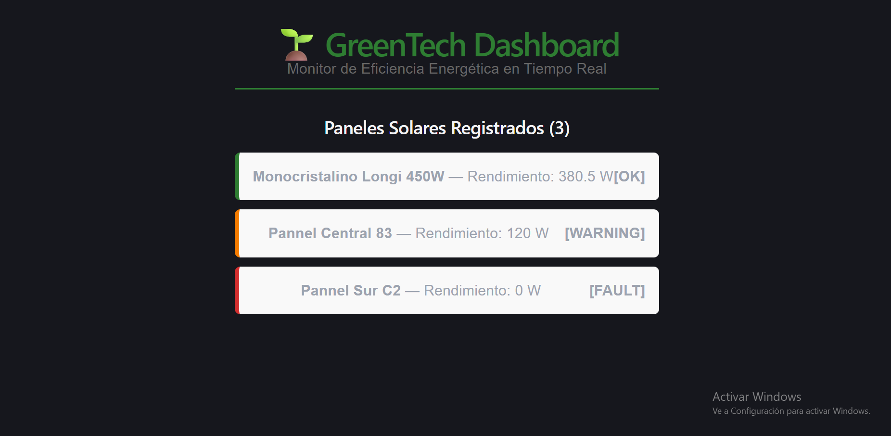

# GreenTech Dashboard 🌱
> **Real-Time Energy Efficiency Monitor**

[](https://www.oracle.com/java/)
[](https://spring.io/projects/spring-boot)
[](https://react.dev/)
[](https://www.typescriptlang.org/)
[](https://www.postgresql.org/)
[](https://render.com/)

GreenTech Dashboard is a cross-platform Full-Stack application designed to register, monitor, and analyze solar panel efficiency in real time. This ecosystem was engineered following **SOLID principles**, design patterns, and an end-to-end strictly typed contract approach to guarantee loose coupling and long-term scalability.

## 🔗 Live Deployments
* **Live Frontend Client:** [https://greentech-frontend-zh4x.onrender.com/](#)
* **REST API & Swagger UI Documentation:** [https://greentech-backend-8rmi.onrender.com/swagger-ui/index.html](#)

---

## 🛠️ Architecture & Tech Stack

The system is architected into completely decoupled layers to ensure high cohesion and maintainability:

### Backend (Application Core)
* **Language:** Java 17 (Robust Object-Oriented Architecture).
* **Framework:** Spring Boot 3 + Spring Data JPA.
* **Dependency Management:** Maven.
* **Database:** PostgreSQL (Scalable relational persistence).
* **API Documentation:** OpenAPI 3 / Swagger UI.

### Frontend (Presentation Layer)
* **Framework:** React 18.
* **Language:** TypeScript (Strict typing ensuring data schema consistency across the wire).
* **Styling:** CSS3 (Modular & responsive layout design).

---

## 🏗️ Architectural Highlights (Engineering Core)

During the development of this ecosystem, several enterprise-level challenges were solved using industry best practices:

* **Layered Clean Architecture:** The backend strictly implements the Separation of Concerns (SoC) principle through well-defined layers (`Controller`, `Service`, `Repository`, `Model`), respecting the Single Responsibility Principle (SRP).
* **Decoupled Data Mapping:** Leveraged advanced Jackson (`@JsonProperty`) and JPA (`@Column`) mapping configurations to seamlessly bridge the gap between *camelCase* API payloads and *snake_case* relational database standards in PostgreSQL.
* **Granular CORS Policy Regulation:** Engineered a cross-origin resource sharing configuration allowing secure web components to communicate flawlessly across different deployment environments without compromising REST API integrity.
* **End-to-End Type Safety:** Controlled the device lifecycles using native Java Enumerations (`PanelStatus`) mapped straight into strict TypeScript interfaces on the React client side, eliminating common execution runtime type mismatches.
* **High-Precision Time Operations:** Standardized temporal fields with `LocalDateTime` formatting to manage high-precision synchronization payloads across network sockets.

---

## 📸 Dashboard Preview

*(Pro-tip: Replace this with your actual app screenshot or an animated GIF)*


---

## 🚀 Local Installation & Setup

### Prerequisites
* Java 17 SDK or higher.
* Maven 3.8+.
* Node.js & npm (Latest LTS).
* Active PostgreSQL instance.

 ### 1. Clone the Repository
 ```bash
  git clone [https://github.com/UlisesXXXI31/greentech-dashboard](https://github.com/UlisesXXXI31/greentech-dashboard)
  cd greentech-dashboard

### 2. Backend Configuration (/backend)
Create or edit the src/main/resources/application.properties file with your local database credentials:

spring.datasource.url=jdbc:postgresql://localhost:5432/greentech_db
spring.datasource.username=your_postgres_user
spring.datasource.password=your_postgres_password
spring.jpa.hibernate.ddl-auto=update

Fire up the Spring Boot development server using Maven:

* mvn spring-boot:run

### 3.Frontend Configuration (/frontend)
Install the node dependencies and spin up the React local development environment:

* npm install
* npm run dev

## 📂 Core REST API Schema

* GET /api/panels - Fetches the collection of registered solar panels and metrics.

* POST /api/panels - Stores a new solar panel verifying state constraints through PanelStatus enums.

// Sample JSON payload for POST /api/panels
{
  "model": "Monocristalino Longi 450W",
  "currentOutput": 380.5,
  "status": "OK",
  "installationDate": "2026-06-12T14:58:06",
  "lastUpdate": "2026-06-12T14:58:06"
}

## ✉️ Contact
Developed by [Daniel Gómez Rodríguez] – Feel free to connect!

LinkedIn: www.linkedin.com/in/daniel-gomez-rodriguez-93708062

Email: danielgroz@gmail.com

